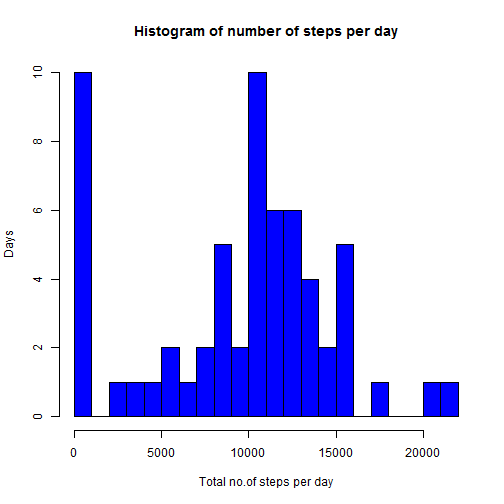
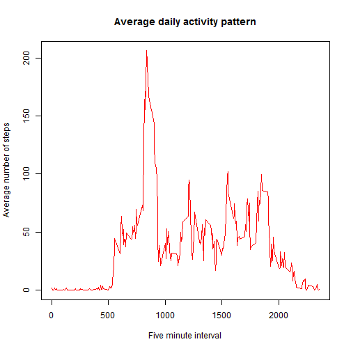
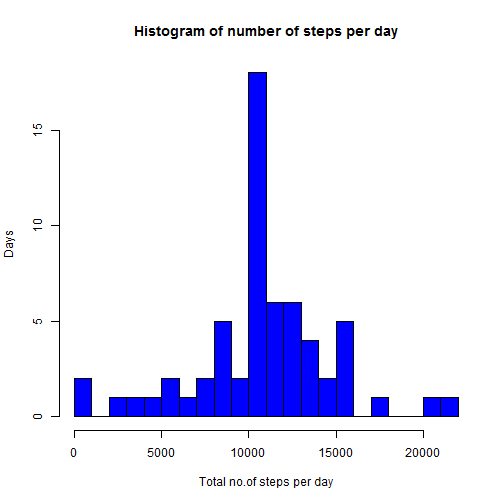
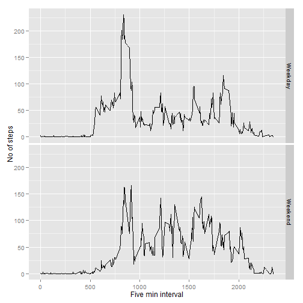

## Loading and preprocessing the data

```r
unzip(zipfile="activity.zip")
activity_data <- read.csv("activity.csv")
```

## What is mean total number of steps taken per day?

```r
tot_steps <- tapply(activity_data$steps, activity_data$date, FUN=sum, na.rm=TRUE)
hist(tot_steps, xlab="Total no.of steps per day",breaks=20,col="blue",
     ylab="Days",main="Histogram of number of steps per day")
```

 

```r
mean(tot_steps, na.rm=TRUE)
```

```
## [1] 9354.23
```

```r
median(tot_steps, na.rm=TRUE)
```

```
## [1] 10395
```

## What is the average daily activity pattern?

```r
avg_activity <- aggregate(x=list(steps=activity_data$steps), 
                          by=list(interval=activity_data$interval),
                          FUN=mean, na.rm=TRUE)
plot(avg_activity$interval,avg_activity$steps,
     type ="l",
     xlab="Five minute interval",
     ylab="Average number of steps",
     main="Average daily activity pattern",
     col ="red")
```

 

```r
#On average across all the days in the dataset, 
#the 5-minute interval contains the maximum number of steps?
avg_activity[which.max(avg_activity$steps),]
```

```
##     interval    steps
## 104      835 206.1698
```

## Imputing missing values

```r
missing_values <- is.na(activity_data$steps)
#how many ??
sum(missing_values==TRUE)
```

```
## [1] 2304
```

```r
# create new dataset with missing value as the mean of 5 -min interval
fill_values <- function(steps, interval) {
        filled <- NA
        if (!is.na(steps))
                filled <- c(steps)
        else
                filled <- (avg_activity[avg_activity$interval==interval, "steps"])
        return(filled)
        
}
imputed_data <- activity_data
imputed_data$steps <- mapply(fill_values, imputed_data$steps, 
                           imputed_data$interval)
#make histogram with imputed data
tot_steps <- tapply(imputed_data$steps, imputed_data$date, FUN=sum)
hist(tot_steps, xlab="Total no.of steps per day",breaks=20,col="blue",
     ylab="Days",main="Histogram of number of steps per day")
```

 

```r
mean(tot_steps)
```

```
## [1] 10766.19
```

```r
median(tot_steps)
```

```
## [1] 10766.19
```

```r
#The mean and median values increased !
```


## Are there differences in activity patterns between weekdays and weekends?

```r
find_type_day <- function(date) {
        day <- weekdays(date)
        if (day %in% c("Monday", "Tuesday", "Wednesday", "Thursday", "Friday"))
                return("Weekday")
        else if (day %in% c("Saturday", "Sunday"))
                return("Weekend")
        else
                stop("Some issue with date")
}
imputed_data$date <- as.Date(imputed_data$date)
imputed_data$day <- sapply(imputed_data$date, FUN=find_type_day)

#make panel plot
library(ggplot2)
avgs <- aggregate(steps ~ interval + day, data=imputed_data, mean)
ggplot(avgs, aes(interval, steps)) + geom_line() + facet_grid(day ~ .) +
        xlab("Five min interval") + ylab("No of steps")
```

 
